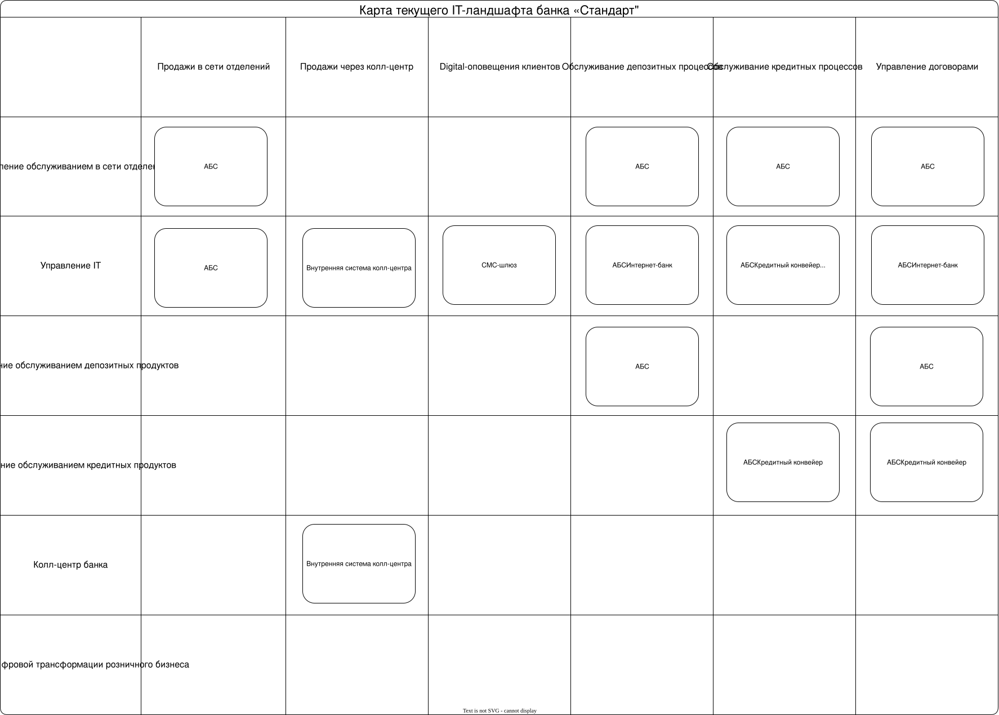

## Карта IT-ландшафта

## Схема интеграции IT-систем

[Ссылка на схему](integration.puml)

## Примечания:

- Хотя в описании процессов открытия счета и кредита выделен Excel и электронная почта как способ связи между специалистами, они не являются самостоятельными IT-системами и не выделены ни на схеме IT-ландшафта, ни на схеме интеграции систем.
- Среди выделенных бизнес-возможностей отсутствуют подходящие для сайта банка, поэтому он не отображен на схеме IT-ландшафта.
- На схеме IT-ландшафта опущены внешние IT-системы и внешние команды/подрядчики, так как они не являются частью самой компании. Однако, так как они взаимодействуют с компанией, они выделены на схеме интеграции систем.